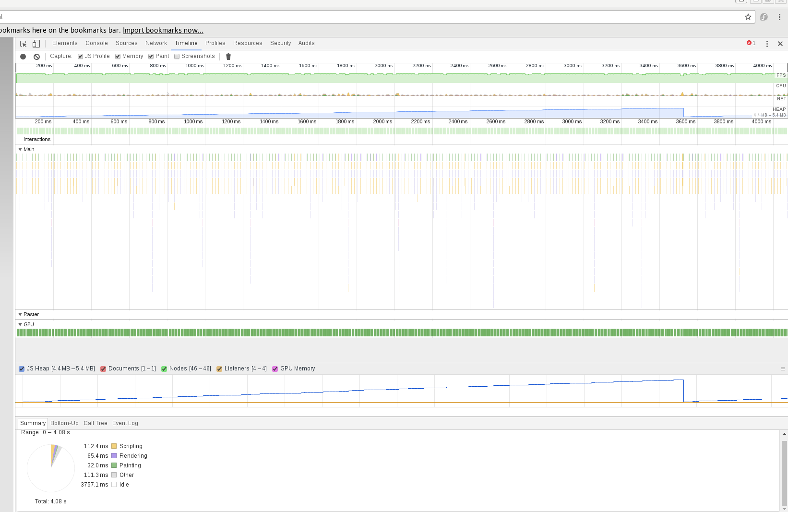
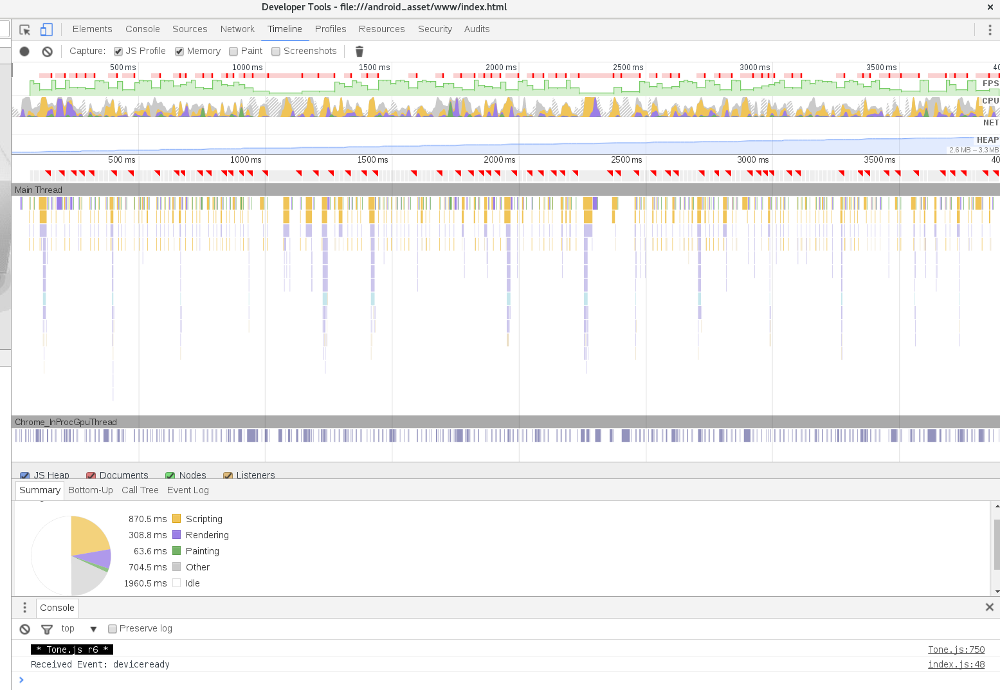
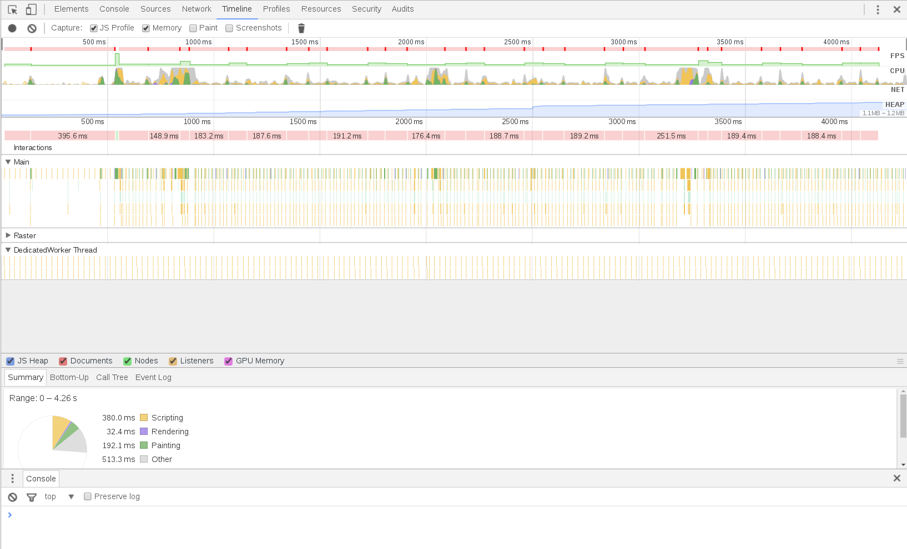
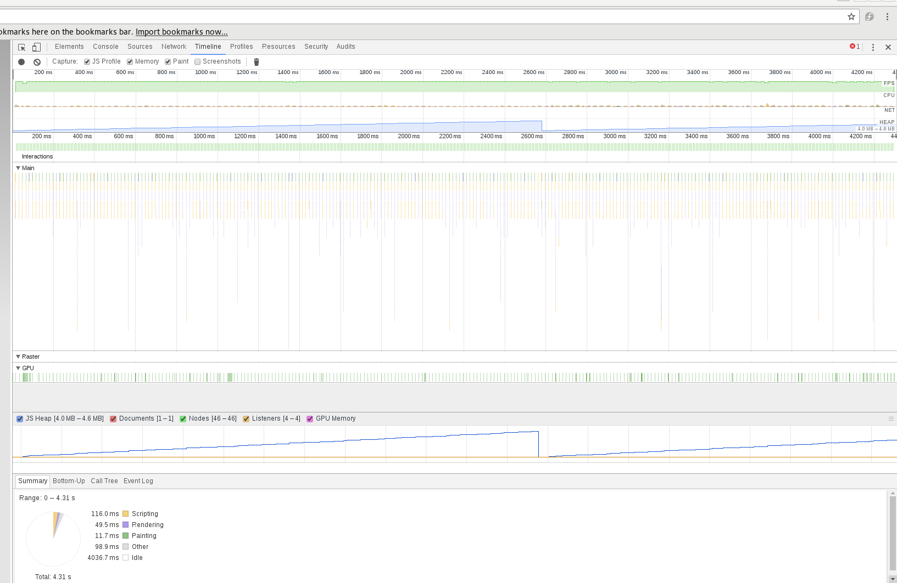
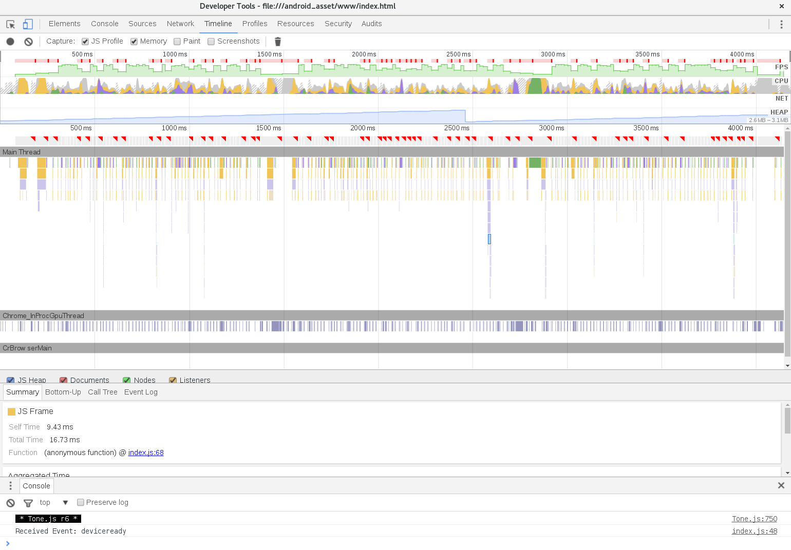

# Performance notes - js profiling

## Notes

Trying to work out why a simple part plays so badly out of time on mobile devices. Obviuosly something wrong with my code, as there are various working examples of Tone.js apps out there (and webaudio) that play perfectly in time on mobile devices.

A 4 second profile in the browser looking (amd sounding!) smooth:

And a 4 second profile from the aldi phone (not sounding so smooth):

So some problems with Parts maybe?

We know the Aldi phone can play back webaudio smoothly; here's Chris Wilson's metronome program, for example:

Similar results when using a Tone.Sequence rather than a Tone.Part. Here's a profile running on the browser:

And on the phone:

Profile of using a sequence in Tone.js on the Aldi phone: aldi_phone_sequence_TimelineRawData-20160720T180110.json

### 20160722

The difference in timing (from an aural point of view) isn't that great between the Samsung S4, which is operating at close to 60fps, and the Aldi phone, which can go right down to 6fps.

How does the metronome on the Aldi phone go?

* First the metronome app from the chrome browser in the phone - so just pointing at the website; works fine

* Now trying the metronome app as converted to a cordova/crosswalk app;

### 20160723

Spent some time getting my head around how scheduling in Tone.js works. The animationRequestFrame is used to set up the scheduling loop; the actual playing loop is on the separate webaudio thread. Looking at distances between when the callback for a sequence gets called should show what's going though right? It gets called when it's time to play, and we play. Perhaps it's a speed problem in that code? But what matters is when it gets called, and that's what the spreadsheet showed.

On that, I put together a Google sheet that marked out when the callback was being called. That's where the scheduling delay seems to exist.

### 20160724

Tried different threshold (1.0), and smaller (16,32) and larger (192) ppq values. Still no change.

Next thing to look at is how long those sequence callbacks take to execute. Can go back to spreadsheet and add in this data. If there's a correlation, then we have a bit more info.

Still in the pipeline is to set up an independent, Chris Wilson style schedule. There are definitely some lower level webaudio options available, so that's comforting.

This was tagged in git with "thread_sched".

How about seeing if the sequence callback will work if we try different instruments with maybe a lower overhead? So a Tone.Player maybe?

#### Sequence callback with low level webaudio SimpleSynth

So with an osc fired within the sequence callback, performance is fine. That would indicate that the overhead of a complex synth might be the problem?

Tagged in git with "sequencer_osc"

#### Sequence callback with Tone.MonoSynth()

No good in Android; taking about 5-8ms for each synth call.

#### Sequence callback with Tone.AMSynth()

No good in Android; up to 10ms for each synth call.

#### Sequence callback with Tone.Player()

No good in Android; playback stutters (with a pattern to it though? Seems to be in the same place most bars?)

## Profile data

### browser_TimelineRawData-20160719T171045.json

Smooth timing; using crosswalk webview

### s4_024_TimelineRawData-20160719T172752.json

On S4,

    Tone.Clock.\_lookAhead = 0.024

Noticing framerate dropping to 32, and 33ms per frame at times

### metronome_wilson_aldi_phone_TimelineRawData-20160720T160547.json

Chris Wilson's metronome on aldi phone - plays back in time

### metronome_wilson_browser_TimelineRawData-20160720T160547.json

Chris Wilson's metronome on browser - plays back in time

### aldi_phone_TimelineRawData-20160720T154034.json

Perftest on Aldi phone - poor timing

### s4_024_TimelineRawData-20160719T172752.json

Perftest on samsung S4

### browser_TimelineRawData-20160719T171045.json

Perftest on browser
